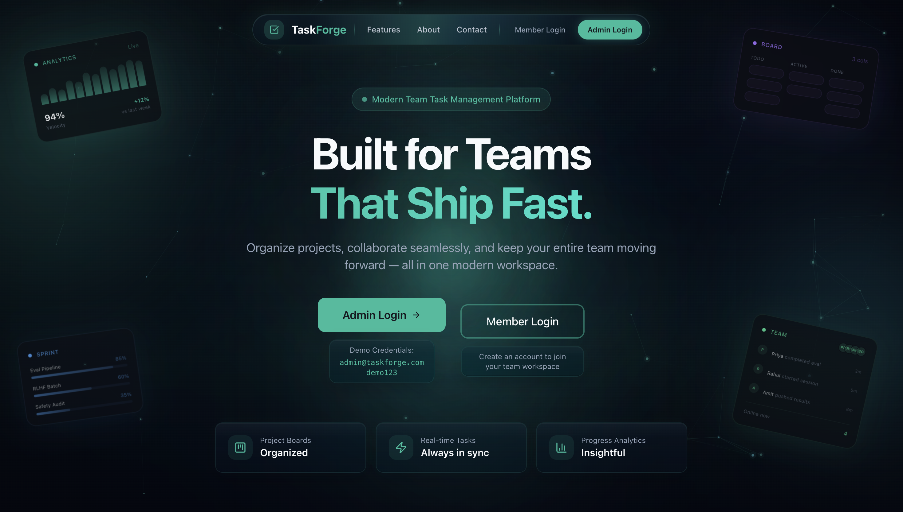
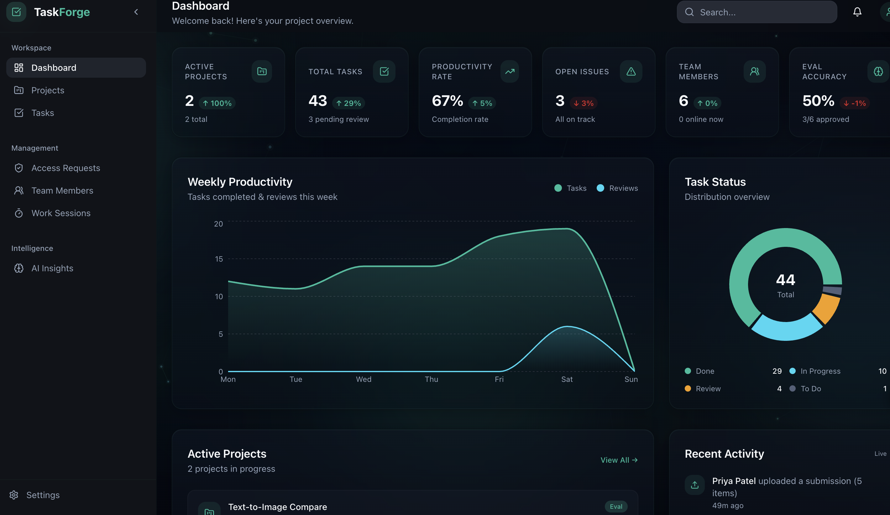
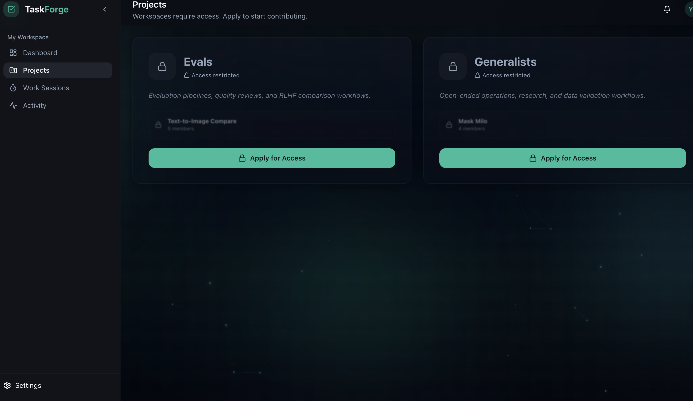

<p align="center">
  
  
  
  
  
</p>

<h1 align="center">⚡ TaskForge</h1>

<p align="center">
  <strong>An AI workflow management platform for teams running evaluation pipelines, RLHF ranking, and generalist operations.</strong><br/>
  Kanban task boards · Punch-in time tracking · Access-gated workspaces · AI-powered insights
</p>

<p align="center">
  <a href="https://intelligent-fulfillment-production-5ef7.up.railway.app">🌐 Live Demo</a> &nbsp;·&nbsp;
  <a href="https://taskforge-production-5bfc.up.railway.app/docs">📖 API Docs</a> &nbsp;·&nbsp;
  <a href="#-quick-start">🚀 Quick Start</a>
</p>

---

## 📸 Screenshots

### Homepage


### Admin Dashboard


### Member — Project View


---

## 🎯 What is TaskForge?

TaskForge is a full-stack project management platform designed for AI/ML teams running evaluation pipelines and generalist workflows. It has **two distinct portals**:

| Portal | Who it's for | Core purpose |
|--------|-------------|--------------|
| **Admin** | Project managers & leads | Create projects, manage Kanban tasks, review access requests, track team work sessions, view AI insights |
| **Member** | Contributors & annotators | Request workspace access, punch in/out to track time, work on assigned projects, view activity feed |

---

## 🔑 Access the Live App

### Admin Portal

Use the demo credentials:

```
Email:    hr@staffsync.com
Password: demo123
```

### Member Portal

**Create your own account** — click "Sign Up" on the homepage, fill in your details, and log in.

> After signing up, you'll need to **request access** to a workspace (Evals or Generalists). The admin can then approve your request from the Access Requests page.

---

## ✨ Features

### 👔 Admin Portal

| Feature | Description |
|---------|-------------|
| **Dashboard** | Real-time KPIs — active projects, total tasks, productivity rate, open issues, team members online, eval accuracy. Includes productivity chart and task status breakdown |
| **Kanban Task Board** | Drag-and-drop board with 5 columns: Backlog → Assigned → In Progress → Review → Done. Create tasks with title, type, priority (low/med/high/critical), assignee, and due date |
| **Projects** | Two categories — **Evals** (quality reviews, safety audits, RLHF comparisons) and **Generalists** (open-ended ops, research, data validation). Each project has: overview, members, submissions, issues tab, and activity log |
| **Access Requests** | Members must apply for workspace access. Admin reviews pending requests and approves or rejects them. Badge count shows pending requests in the sidebar |
| **Work Sessions** | View all team members' punch-in sessions in real-time. See who's active now, total hours logged, session durations (live-updating), and filter by status |
| **Team Members** | Manage team — view all members, their roles, and status |
| **AI Insights** | Analytics dashboard with: most delayed project, fastest contributor, backlog growth, avg task completion time, peak productivity hours, team leaderboard, weekly trends, and AI-generated recommendations |
| **Issues** | Raise and resolve issues on any project. Track open issues across all projects from the dashboard |

### 👤 Member Portal

| Feature | Description |
|---------|-------------|
| **Dashboard** | Personal workspace with KPIs (my projects, avg progress, today's tracked time, session count), weekly activity chart, task status donut, workspace access cards, active projects with quick-start buttons |
| **Punch In / Punch Out** | One-click time tracking. Start a general session or tie it to a specific project. Live timer updates every second. Session history with durations |
| **Projects** | View Evals and Generalists workspaces. If access is granted, browse projects and start working. If locked, apply for access (shows blurred preview). If pending, shows "awaiting review" |
| **Work Sessions** | Full session history — today's time, all-time total, session count. Each session shows project name, start/end time, and duration |
| **Activity Feed** | Notifications about access request updates, task assignments, and project reviews. Mark as read individually or all at once |
| **Start Task** | From any assigned project, click "Start Task" to begin a tracked work session tied to that project |

---

## 🔄 Core Workflows

```
┌─────────────────────────────────────────────────────────────────┐
│                     MEMBER ONBOARDING                            │
├─────────────────────────────────────────────────────────────────┤
│  1. Member signs up → creates account                           │
│  2. Member goes to Projects → sees locked workspaces            │
│  3. Member clicks "Apply for Access" on Evals or Generalists    │
│  4. Admin sees request in Access Requests → Approves            │
│  5. Member now has access → can view projects & start tasks     │
└─────────────────────────────────────────────────────────────────┘

┌─────────────────────────────────────────────────────────────────┐
│                     PUNCH IN / TIME TRACKING                    │
├─────────────────────────────────────────────────────────────────┤
│  Member: Clicks "Punch In" → live timer starts                  │
│  Member: Works on tasks → timer runs in background              │
│  Member: Clicks "Punch Out" → session logged with duration      │
│  Admin:  Sees all active sessions in real-time on Work Sessions │
│  Admin:  Dashboard shows "X members online now"                 │
└─────────────────────────────────────────────────────────────────┘

┌─────────────────────────────────────────────────────────────────┐
│                     TASK MANAGEMENT (ADMIN)                      │
├─────────────────────────────────────────────────────────────────┤
│  Admin: Opens Kanban board → creates task with priority          │
│  Admin: Assigns task to team member → places in column          │
│  Admin: Drags tasks between columns as work progresses          │
│  Columns: Backlog → Assigned → In Progress → Review → Done     │
└─────────────────────────────────────────────────────────────────┘

┌─────────────────────────────────────────────────────────────────┐
│                     ISSUES WORKFLOW                              │
├─────────────────────────────────────────────────────────────────┤
│  Admin or Member: Raises an issue on a project                  │
│  Admin: Views open issues across all projects on dashboard      │
│  Admin: Resolves issues from the project detail → Issues tab    │
└─────────────────────────────────────────────────────────────────┘
```

---

## 🏗️ Architecture

```
TaskForge/
├── frontend/                 # React + TypeScript SPA
│   ├── src/
│   │   ├── pages/
│   │   │   ├── hr/          # Admin portal (Dashboard, Projects, Tasks, etc.)
│   │   │   ├── member/      # Member portal (Dashboard, Projects, Work Sessions, Activity)
│   │   │   └── employee/    # Legacy employee pages
│   │   ├── components/
│   │   │   ├── hr/          # Admin components (Kanban, charts, project tabs)
│   │   │   ├── member/      # Member components (layout, session cards)
│   │   │   ├── homepage/    # Landing page sections
│   │   │   └── ui/          # shadcn/ui component library
│   │   ├── contexts/        # ProjectsContext, WorkspaceContext, UserContext
│   │   ├── hooks/           # Custom React hooks
│   │   └── lib/             # API client, utilities, constants
│   └── package.json
│
├── backend/                  # FastAPI Python server
│   ├── app/
│   │   ├── api/             # Route handlers (auth, hr, employee)
│   │   ├── models/          # SQLAlchemy ORM models
│   │   ├── schemas/         # Pydantic validation schemas
│   │   ├── core/            # Auth, security, dependencies
│   │   ├── config.py        # Environment configuration
│   │   ├── database.py      # DB connection & session management
│   │   └── main.py          # FastAPI app entry point
│   └── requirements.txt
│
└── screenshots/              # App screenshots
```

---

## 🛠️ Tech Stack

### Frontend
| Technology | Purpose |
|-----------|---------|
| **React 18** | UI framework |
| **TypeScript** | Type safety |
| **Vite** | Build tool & dev server |
| **Tailwind CSS** | Utility-first styling |
| **shadcn/ui + Radix** | Accessible component library |
| **@dnd-kit** | Drag-and-drop for Kanban board |
| **Recharts** | Charts (area, pie, donut) |
| **React Router v6** | Client-side routing |
| **TanStack Query** | Server state management |
| **Axios** | HTTP client |
| **React Hook Form + Zod** | Form handling & validation |

### Backend
| Technology | Purpose |
|-----------|---------|
| **FastAPI** | High-performance Python web framework |
| **SQLAlchemy 2.0** | ORM & database toolkit |
| **PostgreSQL** | Production database |
| **Pydantic v2** | Data validation & serialization |
| **JWT (python-jose)** | Token-based authentication |
| **Passlib + bcrypt** | Password hashing |
| **Alembic** | Database migrations |

### Infrastructure
| Service | Purpose |
|---------|---------|
| **Railway** | Hosting (frontend, backend, database) |
| **PostgreSQL on Railway** | Managed database with persistent volume |

---

## 📊 Key Data Points

| Metric | Value |
|--------|-------|
| API Endpoints | 25+ RESTful routes |
| Kanban Columns | 5 (Backlog, Assigned, In Progress, Review, Done) |
| Task Priorities | 4 (Low, Medium, High, Critical) |
| Project Categories | 2 (Evals, Generalists) |
| Auth System | JWT with access + refresh tokens |
| Role Types | 2 (Admin, Member) |
| Access States | 3 (Granted, Pending, Locked) |
| Session Tracking | Real-time with per-second updates |

---

## 🚀 Quick Start

### Prerequisites

- Python 3.10+
- Node.js 18+
- PostgreSQL (or uses SQLite for local dev)

### Backend

```bash
cd backend
python -m venv venv
source venv/bin/activate
pip install -r requirements.txt
python run.py
```

Server starts at `http://localhost:8000` — API docs at `http://localhost:8000/docs`

### Frontend

```bash
cd frontend
npm install
npm run dev
```

App starts at `http://localhost:5173`

---

## 🔒 Security

- **Password Hashing** — bcrypt with salt rounds
- **JWT Authentication** — Short-lived access tokens (30 min) + refresh tokens (7 days)
- **Role-Based Access Control** — Admin and Member roles with route-level protection
- **Workspace Gating** — Members must be approved before accessing project workspaces
- **CORS** — Configured for specific allowed origins
- **Input Validation** — Pydantic schemas validate all incoming data

---

## 🌐 Deployment

Both services are deployed on **Railway** with automatic deploys:

| Service | URL | Status |
|---------|-----|--------|
| Frontend | [intelligent-fulfillment-production-5ef7.up.railway.app](https://intelligent-fulfillment-production-5ef7.up.railway.app) | ● Online |
| Backend API | [taskforge-production-5bfc.up.railway.app](https://taskforge-production-5bfc.up.railway.app) | ● Online |
| PostgreSQL | Internal (Railway private network) | ● Online |

---

## 📝 License

This project is open source and available for educational and portfolio purposes.

---

<p align="center">
  Built with ☕ and modern web technologies<br/>
  <strong>TaskForge</strong> — AI workflow management, simplified.
</p>
